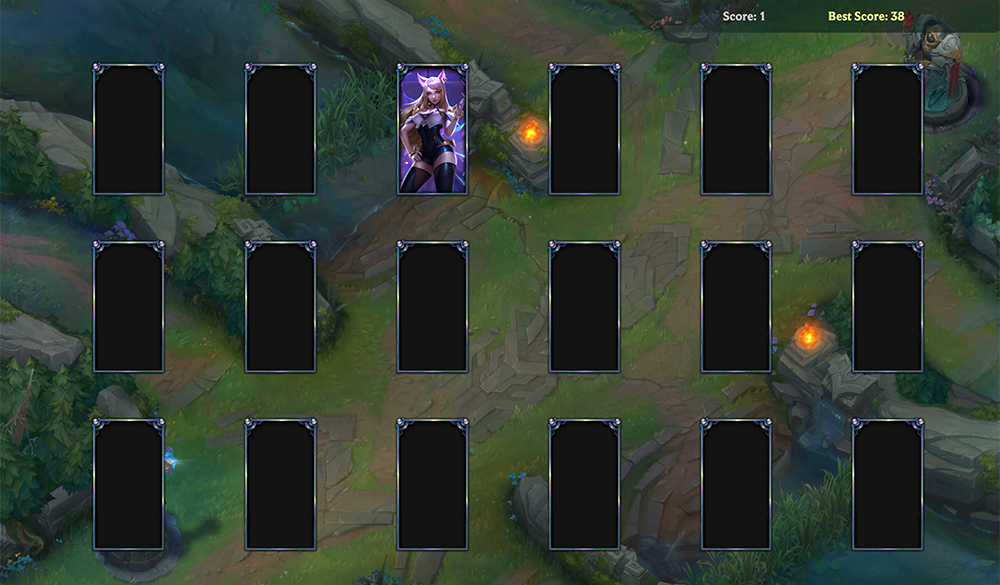
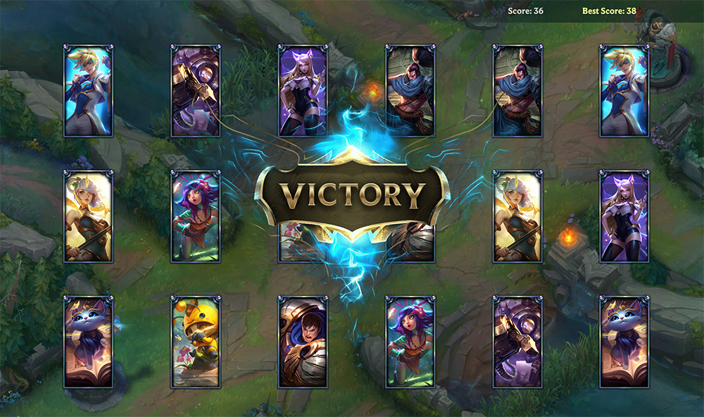

# Match That Champion

Match That Chamption is a League of Legends based memory card game that keeps tracks of users' best score. 

This application uses Bootstrap, HTML, CSS, and vanilla JavaScript. 

Match That Champion is [live on Github](https://kathyn262.github.io/mtc/).

